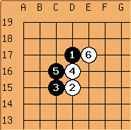

# GoDiagramJS
A small Javascript library to convert an ASCII representation of a Go (Baduk|Weiqi) diagram into an SVG drawing.

GoDiagramsJS is a straight port to Javascript of sltxt2png.php, the PHP tool Arno Hollosi and Morten Pahle created for 
their Go site  [Sensei Library](https://senseis.xmp.net/?HowDiagramsWork).
The only major difference is in the output: instead of a bitmap image, GoDiagramsJS produces an SVG drawing embedded 
in an <svg> </svg> element ready for inclusion in HTML code.

Example: ASCII representation
````
$$c Nadare joseki
$$  --------------
$$ | . . . . . . .
$$ | . . . . . . .
$$ | . . . 1 6 . .
$$ | . . 5 4 . . .
$$ | . . 3 2 . . .
$$ | . . . . . . .
$$ | . . . . . . .
````

And a bitmap rendered version:



The diagram's element may include markup (circles, squares, letters, etc.) and each element may include a link. Arrows and areas can also be visualized. See the Sensei library page for a [complete description of the ASCII board syntax](https://senseis.xmp.net/?HowDiagramsWork). A brief summary is included in the header of  the javascript file. 

All the basic components (stones, lines, goban, etc.) are identified by classes and can be styled with an external CSS sheet. 
A skeletal CSS file is provide as proof of concept. 

Copyright (C) 2001-2004 for the original sl2png.php library by  Arno Hollosi <ahollosi@xmp.net> and Morten Pahle 
<morten@pahle.org.uk>.
Copyright (C) 2019 of the Javascript code by Stefano Franchi 2019 <stefano.franchi@gmail.com>

Released under the GPL v. 3.0 or later.
